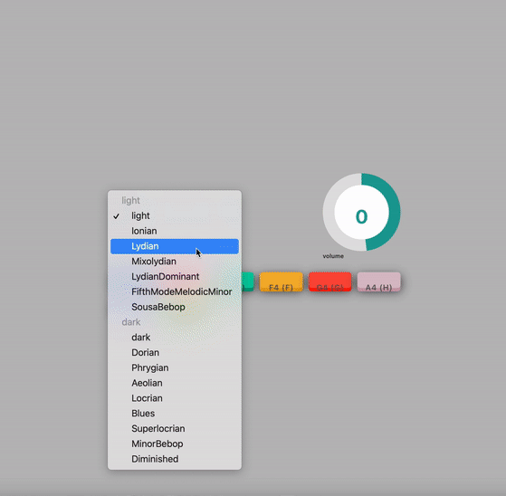

# REACT SythPad_2021

### Github Link: 
[View Code: REACT_SynthPad_2021](https://github.com/Oliviapark113/react_synthPad_2021).

## User Story

This app is new React-based Sythpad app.
This App created with React components, working with hooks/util functions, and utilize React lifecycle methods to query and display key-board and sounds.

## Installation 

 `npm i react-dial-knob`
 `npm i react-polished`
 `npm i styled-components`
 
## Credits 

This is Class activities created by Instructor and I followed along the code to learn REACT custom hooks , context.

## DEMO 

### Deployed Link: 
[Deployed Sites: React-SynthPad-2021](https://Oliviapark113.github.io/react_synthPad_2021/).
